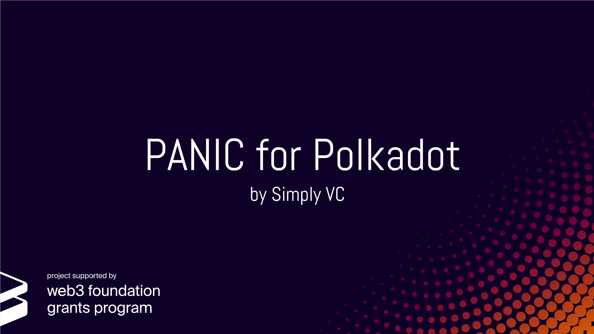

# PANIC for Polkadot

PANIC for [Polkadot](https://polkadot.network/) is a lightweight yet powerful open source monitoring and alerting solution for Polkadot nodes by [Simply VC](https://simply-vc.com.mt/). It is compatible with any [Substrate](https://www.parity.io/substrate/) based chain provided that it is injected with the default types (latest Polkadot and Substrate master types). The tool was built with user friendliness in mind, without excluding cool and useful features like phone calls for critical alerts and Telegram commands for increased control over your alerter.

The alerter's focus on a modular design means that it is beginner friendly but also developer friendly. It allows the user to decide which components of the alerter to set up while making it easy for developers to add new features. PANIC also offers two levels of configurability, _user_ and _internal_, allowing more experienced users to fine-tune the alerter to their preference.

We are sure that PANIC will be beneficial for node operators in the Polkadot community and we look forward for feedback. Feel free to read on if you are interested in the design of the alerter, if you wish to try it out, or if you would like to support and contribute to this open source project, or just check out upcoming features.

## Design and Features

To be able to monitor and alert, PANIC was designed to retrieve data from Polkadot nodes using a custom-built JavaScript (JS) API. The JS API is an intermediate component which interacts with the Polkadot nodes via the [polkadot-js/api](https://polkadot.js.org/api/). For more details on the JS API please [read this](api/README.md). If you want to dive into the design and feature set of PANIC [click here](alerter/doc/DESIGN_AND_FEATURES.md).

## Ready, Set, Alert!

PANIC is highly dependent on the JS API for correct execution. Therefore, if you are ready to try out PANIC on your Polkadot nodes, you should first setup and run the JS API on **ALL** nodes you want to monitor using [this guide](api/doc/INSTALL_AND_RUN.md). After the JS API is successfully running, you should set up and run the alerter using [this guide](alerter/doc/INSTALL_AND_RUN.md).

## Support and Contribution

On top of the additional work that we will put in ourselves to improve and maintain the tool, any support from the community through development will be greatly appreciated. Before contributing please make sure to read the contribution [guidelines here](CONTRIBUTING.md).

## Who We Are
Simply VC runs highly reliable and secure infrastructure in our own datacentre in Malta, built with the aim of supporting the growth of the blockchain ecosystem. Read more about us on our website and Twitter:

- Simply VC website: <https://simply-vc.com.mt/>
- Simply VC Twitter: <https://twitter.com/Simply_VC>

---

Official PANIC for Polkadot image adapted from [slidescarnival.com](https://www.slidescarnival.com/)
