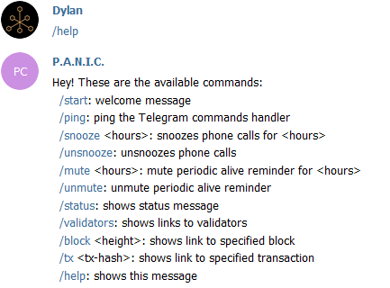

# Design and Features of PANIC

This page will present the inner workings of the alerter as well as the features that one is able to interact with and how. The following points will be presented and discussed:

- [**Design**](#design)
- [**Alerting Channels**](#alerting-channels): (console, logging, Telegram, email, Twilio)
- [**Alert Types**](#alert-types): (critical, warning, info, error)
- [**Monitor Types**](#monitor-types): (node, blockchain, GitHub)
- [**Periodic Alive Reminder**](#periodic-alive-reminder)
- [**Telegram Commands**](#telegram-commands)
- [**Redis**](#redis)
- [**Complete List of Alerts**](#complete-list-of-alerts)

## Design

The diagram below gives an idea of the various components at play when PANIC is running, and how they interact with each other and the node operator:

- **Monitors** extract data from a source and pass it on to the alerters
- **Alerters** store the data (**Redis**) and send alerts to a set of channels
- **Channels** pass on the alerts to the appropriate external service
- **Telegram Listener** handles and replies to user commands (using **Redis**)

## Alerting Channels

PANIC currently supports five alerting channels. By default, only console and logging alerts are enabled, allowing the node operator to run the alerter without having to set up extra alerting channels. This is not enough for a more serious and longer-term alerting setup, for which the node operator should set up the remaining alerting channels.

- **Console**: alerts printed to standard output (`stdout`).
- **Logging**: alerts logged to an alerts log (`alerter/logs/alerts/alerts.log`).
- **Telegram**: alerts delivered to a Telegram chat via a Telegram bot.
- **Email**: alerts sent as emails using an SMTP server, with option for authentication.
- **Twilio**: alerts trigger a phone call to grab the node operator's attention.

Instructions on how to set up the alerting channels can be found in the [installation guide](INSTALL_AND_RUN.md).

## Alert Types

Different events vary in severity. We cannot treat an alert for a new version of Polkadot as being on the same level as an alert for validator downtime. PANIC makes use of four alert types:

- **CRITICAL**: the most severe alert and the only type of alert that uses the Twilio phone calling. **Example**: validator has been slashed.
- **WARNING**: a less severe alert but which still requires attention as it may be a warning of an incoming critical alert. **Example**: validator is not elected to validate for the next session.
- **INFO**: little to zero severity but consists of information which is still important to acknowledge. Info alerts also include positive events. **Example**: increase in bonded balance.
- **ERROR**: triggered by abnormal events and ranges from zero to high severity based on the error that has occurred and how many times it is triggered.

## Monitor Types

An aspect of the design of PANIC that is less visible to the user is that there are multiple monitor types. Once PANIC is started it detects the number of nodes and which chain(s) they belong to, and automatically launches the necessary number of monitors of each type.

- **Node monitor** (one per node): deals with node-specific details such as bonded balance and number of peers.
- **Blockchain monitor** (one per chain): deals with chain-specific details such as changes in the size of the validator set and new referendums.
- **GitHub monitor** (one per repository): uses the GitHub API to keep track of the number of releases in a repository and alerts on a new release.

This section will go through each monitor type in greater detail.

### Node Monitor

The node monitor is designed to monitor the state of exactly one validator/full node, such that multiple node monitors are started up if you set up PANIC with multiple nodes.

In PANIC there is a distinction between a node monitor for full nodes and a node monitor for validators. In fact, a node monitor consists of at most three types of monitoring.

- **Direct monitoring** (for both validators and full nodes): the node monitor obtains node data from the node it is monitoring. **Example**: The number of peers.  
- **Indirect monitoring** (for validators only): the node monitor obtains validator data from a full node. This is done so that if the validator is experiencing issues, reliable data is still obtained. **Example**: The bonded balance and the number of blocks authored.
- **Archive monitoring** (for validators only): part of indirect monitoring, but here the node monitor obtains validator data from an archive node. This type of monitoring makes the node monitor look into blockchain data from the past. **Example**: Checking whether a validator has been slashed at a particular block height.

Due to the fact that a node monitor may need a full node as data source, a node monitor does not start up if there are no full nodes from the same chain. Another important note on full node availability is that if for a validator node monitor there are no full nodes accessible in a monitoring round, a `CRITICAL` alert is raised because indirect data could not be obtained. Therefore, having additional full nodes increases data source redundancy.

An important note with regards to archive monitoring is that PANIC still starts if there is no archive node available, however, archive monitoring will be disabled since looking for data in non-archive nodes may raise errors if that non-archive node does not have data from the past. Also, if no archive node is accessible in a monitoring round, archive monitoring is disabled until an archive node becomes accessible. Therefore, having additional archive nodes increases data source redundancy.

In a typical monitoring round for validators the node monitor first performs direct monitoring, then indirect monitoring, and finally archive monitoring if enabled. On the other hand, in a typical monitoring round for full nodes, the node monitor performs direct monitoring only.

In direct monitoring, the node monitor does the following:

1. Checks if the node is reachable using a JS API command on the node itself.
2. Gets the nodes' data using a series of JS API commands on the node itself.
    1. Gets and stores the is-syncing status
    2. Gets and stores the number of peers
    3. Gets and stores the latest finalized block height
3. Declares the custom JS API as accessible

In indirect monitoring, the node monitor does the following:

1. Gets the validators' data using a series of JS API commands on a full node.
    1. Checks and stores whether the validator is still active in current session.
    2. Checks and stores whether the validator is elected to validate in the next session.
    3. Gets and stores the bonded balance.
    4. Checks and stores whether the validator is a council member.
    5. Checks whether a new session has been created.
        1. If yes reset the number of authored blocks by validator to zero.
        2. Reset the timer which keeps the time since the last block authored by the validator in current session.
    6. Gets and stores the number of blocks authored by the validator in the current session.
    7. If enabled, performs archive monitoring.
2. Declares the JS API as running.

As already discussed, archive monitoring is part of indirect monitoring. If enabled, during archive monitoring the node monitor does the following: 

1. Chooses an archive node `AN`
2. Checks whether the validator has been slashed at a particular block height
    1. Gets the finalized block height `LastH` of `AN`
    2. Sets the height to check *HeightToCheck* = *LastHChecked* + 1 where *LastHChecked* is the height of the last block checked by the node monitor
    3. If *LastH* - *LastHChecked* > `MCUB`:
        1. Sets *HeightToCheck* = *LastH* - `MCUB`
        2. Gets the block hash at height *HeightToCheck* using the custom JS API
        3. Gets slash amount of validator at height *HeightToCheck*
        4. Alerts if greater than zero.
        5. *LastHChecked* = *HeightToCheck*
    4. Otherwise if *HeightToCheck* <= *LastH* :
        1. Gets the block hash at height *HeightToCheck* using the custom JS API
        2. Gets slash amount of validator at height *HeightToCheck*
        3. Alerts if greater than zero.
        4. *LastHChecked* = *HeightToCheck*
        
Note: 
- If the alerter is not in sync with the archive node with respect to block height, the maximum number of historical blocks checked is `MCUB`, which is configurable from the internal config (`node_monitor_max_catch_up_blocks`).

After performing all types of monitoring, the node monitor concludes by doing the following:

1. Saves both node monitor and node state.
2. Sleeps
    1. If node is validator
        1. Sleeps until the next monitoring round if *LastH*-*LastHChecked* > 2.
    2. else 
        1. Sleeps until the next monitoring round.

Default value:
- `MCUB = node_monitor_max_catch_up_blocks = 500`

### Blockchain Monitor

The blockchain monitor monitors the state of exactly one chain. Therefore, if nodes from `n` chains are given to PANIC, `n` blockchain monitors will be started. 

As discussed before, full nodes should be reliable data sources, therefore, the blockchain monitor was designed to retrieve chain data from full nodes using the JS API.

Similarly to the node monitor, the blockchain monitor does not start up if there are no full nodes from the same chain. Another important note on full node availability is that if there are no full nodes accessible in a monitoring round, a `CRITICAL` alert is raised because data could not be obtained. Therefore, having additional full nodes increases data source redundancy.

In a typical monitoring round, the blockchain monitor does the following:

1. Gets chain data using a series of JS API commands on full nodes.
    1. Gets referendum count
    2. Gets council proposals count
    3. Gets public proposals count
    4. Gets size of the validator set
2. Store new chain data and alert if necessary
    1. While *stored_referendum_count* < *new_referendum_count*
        1. If referendum number *stored_referendum_count* still exists, sets *stored_referendum_count* to *stored_referendum_count* + 1.
    2. Sets *stored_council_prop_count* to *new_council_prop_count*
    3. Sets *stored_public_prop_count* to *new_public_prop_count*
    4. Sets *stored_validator_set_size* to *new_validator_set_size*
3. Sets the JS API as accessible
4. Saves its state
5. Sleeps until the next monitoring round

### GitHub Monitor

The third monitor type is the slightly less important GitHub monitor which uses the GitHub API to periodically get the number of releases in a repository. This serves as a reminder for the node operator to update their node. Due to GitHub's API limits and the less-critical nature, this monitor does not run as frequently as the other monitors. 

In each monitoring round, the GitHub monitor:

1. Gets the list of the repository's releases from the API, for example: <https://api.github.com/repos/polkadot-js/api/releases>
    1. Gets and stores the number of releases
2. Saves its state
3. Sleeps until the next monitoring round

## Periodic Alive Reminder

The periodic alive reminder is a way for PANIC to inform the operator that it is still running. This can be useful to the operator when no alerts have been sent for a long time, therefore it does not leave the operator wondering whether PANIC is still running or not.

The following are some important points about the periodic alive reminder:

1. The time after which a reminder is sent can be specified by the operator using the setup process described [here](./SETUP.md).
2. The periodic alive reminder can be muted and unmuted using Telegram as discussed below.

## Telegram Commands

Telegram bots in PANIC serve two purposes. As mentioned above, they are used to send alerts. However they can also accept commands that allow you to check the status of the alerter (and its running monitors), snooze or unsnooze calls, mute or unmute periodic alive reminders, and conveniently get Kusama CC3 explorer links to validator lists, blocks, and transactions.

For example, if Redis is running along with three node monitors and one blockchain monitor, with calls not snoozed, and periodic alive reminder not muted, the `/status` command returns the following:

## Redis

[Redis](https://redis.io/) is an in-memory key-value store. In the context of the alerter, Redis is used as an in-memory (and thus volatile) copy of a subset of the alerter's state so that:
- The state can be queried, for example to provide a status in Telegram, when the `/status` command is issued.
- When the alerter software restarts or gets restarted, such as to change the configuration, it can continue where it left off.

Included in the alerter state stored in Redis are:
- **For each node:** 
    - Start of downtime, if any
    - Number of peers
    - Bonded balance
    - The `auth_index` value
    - Is-active status. 
    - Is-council member status
    - Is-elected status
    - Is-disabled status
    - Is-syncing status
    - Number of blocks authored
    - Time of last block authored
    - The `is_authoring` value
    - Time of last block check activity
    - The finalized block height
    - Time of last finalized height change
    - Time of last finalized height check activity
    - The `no_change_in_height_warning_alert_sent` value
- **For each node monitor:**
    - Last update time (to know that the monitor is still running)
    - The current session index
    - The last height checked in archive monitoring
- **For each blockchain monitor:**
    - Last update time (to know that the monitor is still running)
    - Public propositions count
    - Council propositions count
    - Referendum count
    - Validator set size

Instructions on how to set up and secure an instance of Redis can be found in the [installation guide](INSTALL_AND_RUN.md).

Notes:

- For a cleaner and correct execution of the alerter, the operator is encouraged to reset redis (clear all data) using the file `run_util_reset_redis.py` when the chain is either upgraded to a new chain, or in extreme cases when a rollback happens. 

## Complete List of Alerts

A complete list of alerts will now be presented. These are grouped into sections so that they can be understood more easily. For each alert, the severity and whether it is configurable from the config files is also included.

### Access to Nodes

Problems when trying to access nodes start with an info alert stating that there are some delays. If the node is inaccessible two times in a row, a warning (critical if validator) alert is raised. An info alert is raised as soon as the node is accessible again. The alerter declares a node to be inaccessible if it lost connection with the JS API. This was done because data cannot be retrieved in this case.

Another important alert is that if the node monitor (only for validators during indirect monitoring) or the blockchain monitor cannot access any full node connected to the JS API, they raise a critical alert.

In addition to this, if the node monitor is supplied with archive nodes and at any monitoring round it cannot access any archive full node connected with the JS API during indirect monitoring, a warning alert is sent by the alerter informing the user that archive monitoring will be disabled until an archive full node is accessible. When an archive full node is then accessible, the user is informed with an info alert that archive monitoring is enabled again.

Notes: 
- When archive monitoring is disabled, indirect and direct monitoring is still enabled.
- Archive monitoring can be disabled before running PANIC by giving no archive nodes for node monitoring in the `alerter/config/user_config_nodes.ini` file.

| Class | Severity | Configurable |
|---|---|---|
| `ExperiencingDelaysAlert` | `INFO` | ✗ |
| `CannotAccessNodeAlert` | `WARNING`/`CRITICAL` | ✗ |
| `StillCannotAccessNodeAlert` | `WARNING`/`CRITICAL` | ✗ |
| `NowAccessibleAlert` | `INFO` | ✗ |
| `CouldNotFindLiveFullNodeConnectedToApiServerAlert` | `CRITICAL` | ✗ |
| `CouldNotFindLiveArchiveFullNodeConnectedToApiServerAlert` | `WARNING` | ✓ |
| `CouldNotFindLiveFullNodeConnectedToApiServerAlert` | `INFO` | ✓ |

### Bonded Balance (Validator Nodes Only)

Bonded balance change alerts are mostly info alerts. A balance increase is always a positive event, but balance decrease has a special case when the balance goes to 0, in which case a critical alert is raised.

To avoid giving alerts when the bonded balance decreases/increases by a very small amount, the user has the option to set a threshold `T` in the internal config, such that no alerts are given if the increase/decrease is greater than 0 but less than `T`

Default values:
- `T = change_in_bonded_balance_threshold = 1`

| Class | Severity | Configurable |
|---|---|---|
| `BondedBalanceIncreasedAlert` | `INFO` | ✗ |
| `BondedBalanceDecreasedAlert` | `CRITICAL` | ✗ |
| `BondedBalanceIncreasedByAlert` | `INFO` | ✓ |
| `BondedBalanceDecreasedByAlert` | `INFO` | ✓ |

### Number of Peers

Alerts for changes in the number of peers range from info to critical.
#### For Validator Nodes
- Any decrease to `N` peers inside a configurable danger boundary `D1` is a critical alert (i.e. `N <= D1`). 
- Any decrease to `N` peers inside a configurable safe boundary `S1` is a warning alert (i.e. `D1 < N <= S1`).
- Any increase to `N` peers inside a configurable safe/danger boundary `S1`/`D1` raises an info alert (i.e. `N <= S1/D1`)
- When the number of peers `N` exceeds `S1`, the operator is notified with a one time info alert to not expect any further alerts if the number of peers remains greater than `S1` irrespective of an increase or decrease.
#### For Non-Validator Nodes 
- Any decrease to `N` peers inside a configurable danger boundary `D2` raises a warning alert (i.e. `N <= D2`). Otherwise, any other decreases raises no alerts.
- Any increase to `N` peers inside a configurable danger boundary `D2` raises an info alert (i.e. `N <= D2`). Otherwise, any other increase raises no alerts.
- When the number of peers `N` exceeds `D2`, the operator is notified with a one time info alert to not expect any further alerts if the number of peers remains greater than `D2` irrespective of an increase or decrease.

Default values:
- `D1 = validator_peer_danger_boundary = 5`
- `D2 = full_node_peer_danger_boundary = 5`
- `S1 = validator_peer_safe_boundary = 10`

| Class | Severity | Configurable |
|---|---|---|
| `PeersIncreasedAlert` | `INFO` | ✓ |
| `PeersIncreasedOutsideDangerRangeAlert` | `INFO` | ✓ |
| `PeersIncreasedOutsideSafeRangeAlert` | `INFO` | ✓ |
| `PeersDecreasedAlert` | `WARNING`/`CRITICAL` | ✓ |

### Is syncing

A node is syncing if it was offline for a while and needs to synchronise with the chain, or when it is not keeping up. A warning and info alert are raised when the node starts and stops syncing, respectively.

| Class | Severity | Configurable |
|---|---|---|
| `IsSyncingAlert` | `MINOR` | ✗ |
| `IsNoLongerSyncingAlert` | `INFO` | ✗ |

### Session (Validator Nodes Only)

Session alerts are meant to help the operator monitor the behaviour of a validator during a validating session. These types of alerts are further divided into four sections.

#### Is Active 

A validator is active if it is in the validator set. When a validator is no longer part of the validator set, a critical alert is raised since the validator is no longer allowed to perform its duties. When the validator then enters the validator set, the operator is informed by an info alert.

 | Class | Severity | Configurable |
|---|---|---|
| `ValidatorIsNowActiveAlert` | `INFO` | ✗ |
| `ValidatorIsNotActiveAlert` | `CRITICAL` | ✗ |

#### Is Elected

A validator is elected if it is currently chosen to be in the validator set for the next session. When a validator is no longer elected, this means that it needs more bonded tokens, therefore the operator is informed by this scenario using a warning alert. Again, when the validator gets elected, the operator is informed via an info alert.

 | Class | Severity | Configurable |
|---|---|---|
| `ValidatorIsElectedForTheNextSessionAlert` | `INFO` | ✗ |
| `ValidatorIsNotElectedForNextSessionAlert` | `WARNING` | ✗ |

#### Blocks Authoring

One of the most important tasks for validators is to author blocks. To make it easier for the operator to monitor this behaviour, PANIC was developed to periodically raise a warning alert if no blocks have yet been authored after `T` seconds since the start of a session. In extension to this, PANIC raises a warning alert if `T` seconds pass since the last block authored in the same session by the validator. To be as helpful as possible to the user, whenever such warning alerts are raised, PANIC raises an info alert to the operator when the validator authors a new block in the same session.

Note:

- In each session, the timer is reset. Therefore these alerts are should be considered per session not cross-session.

Default values:
- `T = max_time_alert_between_blocks_authored = 1800`

 | Class | Severity | Configurable |
|---|---|---|
| `LastAuthoredBlockInSessionAlert` | `WARNING` | ✓ |
| `NoBlocksHaveYetBeenAuthoredInSessionAlert` | `WARNING` | ✓ |
| `ANewBlockHasNowBeenAuthoredByValidatorAlert` | `INFO` | ✗ |

#### Disabled

When a validator is disabled, it can no longer participate in a validating session. Since this is very bad scenario in nature, PANIC raises a critical alert if this happens. To be as helpful as possible, PANIC raises an info alert when the validator is no longer disabled.

 | Class | Severity | Configurable |
|---|---|---|
| `ValidatorHasBeenDisabledInSessionAlert` | `CRITICAL` | ✗ |
| `ValidatorIsNoLongerDisabledInSessionAlert` | `INFO` | ✗ |

### Blockchain

Blockchain alerts inform the user of events related to the blockchain, not the node. These alerts are further divided into four types.

#### Democracy

In PANIC, whenever a new referendum is created and is still available, the user is informed via an info alert that a new referendum has been created along with its ID and end block. Moving on to public proposals, when a new public proposal is created, an info alert is raised along with its ID.

Note:

- If PANIC is switched off and a new referendum is created and ends before PANIC is switched on, PANIC will not alert to the operator.
- If PANIC is switched off and a new public proposal is created and ends before PANIC is switched on, PANIC will still give the alert to the operator.

 | Class | Severity | Configurable |
|---|---|---|
| `NewReferendumAlert` | `INFO` | ✗ |
| `NewPublicProposalAlert` | `INFO` | ✗ |

#### Council

When a validator becomes part of the council, an info alert is raised by PANIC. This is complemented by another info alert when that validator is no longer part of the council.

Another alert related to the council is raised whenever a new council proposal has been created. Similarly to the public proposals, PANIC raises an info alert when a new council proposal has been created (Proposal ID given also).

Note:

- If PANIC is switched off, and a new council proposal is created and ends before PANIC is switched on, PANIC will still give the alert to the operator.
- Note that in the current PANIC design, a council member can only be a validator. Although council members can be any token holders, PANIC is designed for validators and thus this functionality considers only validators. 

 | Class | Severity | Configurable |
|---|---|---|
| `NewCouncilProposalAlert` | `INFO` | ✗ |
| `ValidatorIsNowPartOfTheCouncilAlert` | `INFO` | ✗ |
| `ValidatorIsNoLongerPartOfTheCouncilAlert` | `INFO` | ✗ |

#### Validator Set

When the validator set size increases or decreases PANIC raises an info alert.

 | Class | Severity | Configurable |
|---|---|---|
| `ValidatorSetSizeDecreasedAlert` | `INFO` | ✗ |
| `ValidatorSetSizeIncreasedAlert` | `INFO` | ✗ |

### Slashing

Slashing is a scenario which occurs whenever the validator is not behaving as expected. Therefore, whenever such an event happens, PANIC raises a critical alert.

 | Class | Severity | Configurable |
|---|---|---|
| `ValidatorHasBeenSlashedAlert` | `CRITICAL` | ✗ |

### Finalized Block Height

Another important component to monitor is the finalized block height of a node. Whenever the finalized block height of a node is not updated for a long time, this means that either the finalization algorithm is not working as intended, or that the node is not behaving as expected, where in the case of a validator this might mean that the validator is finding it difficult to declare the block as finalized. In PANIC this functionality is implemented as follows.

**For validators**:

- If the finalized block height was not updated for `W` seconds, PANIC raises a warning alert.
- If the finalized block height was not update for `I` > `W` seconds, PANIC raises a critical alert every `I` seconds.

**For non-validators**:

- If the finalized block height was not updated for `W` seconds, PANIC raises a warning alert.
- If the finalized block height was not update for `I` > `W` seconds, PANIC raises a warning alert every `I` seconds.

In both the cases above if PANIC raises an alert that the finalized block height of a node is not being updated and then the finalized block height of a node gets updated, the operator is informed via an info alert

Default values:
- `W = no_change_in_height_first_warning_seconds = 180`
- `I = no_change_in_height_interval_seconds = 600`

 | Class | Severity | Configurable |
|---|---|---|
| `NodeFinalizedBlockHeightDidNotChangeInAlert` | `WARNING/CRITICAL` | ✗ |
| `NodeFinalizedBlockHeightHasNowBeenUpdatedAlert` | `INFO` | ✗ |

### Twilio

The alerter also has some Twilio-specific alerts. Any issue with calling, which only happens during a critical alert, raises another critical alert.

| Class | Severity | Configurable |
|---|---|---|
| `ProblemWhenDialingNumberAlert` | `CRITICAL` | ✗ |
| `ProblemWhenCheckingIfCallsAreSnoozedAlert` | `CRITICAL` | ✗ |

### GitHub

The only two alerts raised by the GitHub alerter are an info alert when a new release is available, and an error alert when there are issues with accessing a repository's releases page.

| Class | Severity | Configurable |
|---|---|---|
| `NewGitHubReleaseAlert` | `INFO` | ✗ |
| `CannotAccessGitHubPageAlert` | `ERROR` | ✗ |

### Periodic Alive Reminder

If the periodic alive reminder is enabled from the config file, and PANIC is running smoothly, the operator is informed every time period that PANIC is still running via an info alert.

The periodic alive reminder always uses the console and logger to raise this alert, however, the operator can also receive this alert via Telegram, Email or both, by modifying the config file as described [here](./SETUP.md).

| Class | Severity | Configurable |
|---|---|---|
| `AlerterAliveAlert` | `INFO` | ✓ |

### JS API

Since PANIC accesses the nodes via the JS API, a node may not be accessible due to the fact that the JS API has lost connection with PANIC. More often than not, this happens when for some reason the JS API has stopped executing. Whenever this happens, an error alert is raised to inform the user that PANIC cannot retrieve data because the JS API is no longer accessible. In the background, PANIC keeps on trying to connect with the JS API. Whenever connection is re-established, the user is informed via an info alert.

| Class | Severity | Configurable |
|---|---|---|
| `ApiIsDownAlert` | `ERROR` | ✓ |
| `ApiIsUpAgainAlert` | `INFO` | ✓ |

### Other (Errors)

Last but not least is a set of error alerts, including read errors when gathering data from a node, termination of a component of the alerter (e.g. a monitor) due to some exception, and any problem experienced when using Telegram bots. 

Another error alert may be raised in archive monitoring. This occurs when the node monitor chooses a node that the operator set as an archive node but in reality it is not. When this happens, PANIC attempts to find another archive node and continues running normally if successful.

| Class | Severity | Configurable |
|---|---|---|
| `ErrorWhenReadingDataFromNode` | `ERROR` | ✗ |
| `TerminatedDueToExceptionAlert` | `ERROR` | ✗ |
| `TerminatedDueToFatalExceptionAlert` | `ERROR` | ✗ |
| `ProblemWithTelegramBot` | `ERROR` | ✗ |
| `FullNodeIsNotAnArchiveNodeAlert` | `ERROR` | ✗ |

---
[Back to front page](../../README.md)