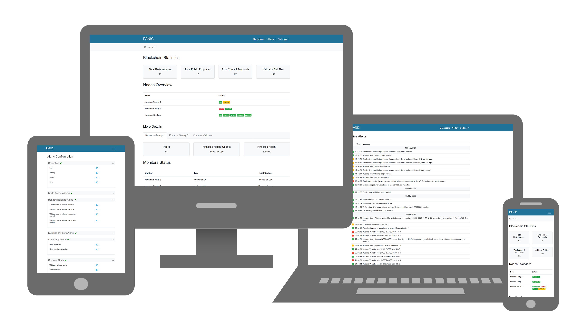

# Design and Features of the Web UI

This page will present the [design](#design) of the PANIC Web UI, as well as the [features](#features) that one is able to interact with.

## Design

The design is responsive, meaning the Web UI can be viewed from any device.

The components at play when using the Web UI are the following:
- **Web UI**: The front-end which the **node operator** uses to set up PANIC, visualize alerts, and monitor the state of nodes and chains together with the alerter itself.
- **Web UI Backend**: A Node.js server used by the **Web UI** to retrieve data from the PANIC store so that it can be visualized in the front-end, and to send data to the PANIC store so that PANIC can be (re-)configured.
- **PANIC Store**: **Redis**, **MongoDB** and the **Configs**. These store the current state of the alerter/nodes/blockchains, the alerts and the PANIC setup respectively.
- **Node operator**: The user making use of the **Web UI**.

The above components can be visualised as follows, along with the remaining components of PANIC (when it is running) represented as **Other Components**:

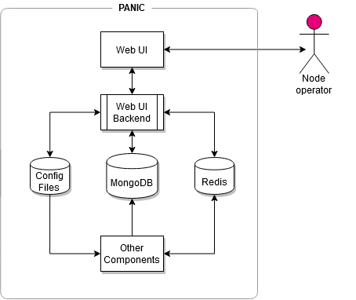

## Features

The Web UI is a clean and easy-to-navigate interface. It consists of a number of pages, each with their own features. These pages are the following:
- [Dashboard page](#dashboard-page)
- [Alert Logs page](#alert-logs-page)
- [Settings pages](#settings-pages)
- [Preferences page](#preferences-page)

### Dashboard Page

The aim of the dashboard is to show the current state of the nodes, chains and monitors using data stored in Redis. It detects which chains/nodes are being monitored by PANIC using the `user_config_nodes.ini` file. Therefore, the user must first setup PANIC as described [here](./SETUP.md) to create the config files, and then must make sure that PANIC is (re-)started manually.

The dashboard groups nodes and monitors according to the chain they belong to. This means that one can choose which chain they want to view dynamically.

For each chain, a number of sections with different types of data are shown in the dashboard. These are the:
- [Blockchain Statistics section](#blockchain-statistics-section), shows chain related data stored in Redis by PANIC. 
- [Nodes Overview section](#nodes-overview-section), shows node related data stored in Redis by PANIC.
- [Monitors Status section](#monitors-status-section), show monitors related data stored in Redis by PANIC.

#### Blockchain Statistics Section

The Blockchain Statistics section shows the state of the selected chain. More specifically, it shows the following data:

- Total Referendums, the total number of referendums so far. 
- Total Public Proposals, the total number of proposals issued by the public so far.
- Total Council Proposals, the total number of proposals issued by the council so far.
- Validator Set Size, the size of the validator set.

**Note**: This section can be disabled for some specific chain `C`. This can be done by setting the field `use_as_data_source` to `false` for every `C` node in the `user_config_nodes.ini` config.

#### Nodes Overview Section

The Nodes Overview section shows the state of the nodes belonging to the selected chain. This section is divided into two, the Nodes Overview Table and the More Details section.

**Note**: This section can be disabled for some specific chain `C`. This can be done by setting the field `monitor_node` to `false` for every `C` node in the `user_config_nodes.ini` config.

##### Nodes Overview Table

The aim of the Nodes Overview Table is to give a quick summary of the status of the nodes belonging to the selected chain. As a result, the user can recognize undesired behaviours at a glance.

For each **non-validator node** belonging to the selected chain, the following badges are shown if the conditions are met:

| **Badge** | **Condition** |
|---|---|
| 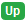 | If the node is **up** |
| 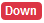 | If the node is **down** |
| 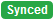 | If the node has **synced** |
| 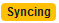 | If the node is **syncing** |

For each **validator node** belonging to the selected chain, in addition to the previous badges, the following badges are shown if the conditions are met:

| **Badge** | **Condition** |
|---|---|
| 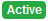 | Shown if the validator is **active** in the current session |
| 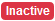 | Shown if the validator is **not active** in the current session |
| 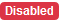 | Shown if the validator is currently **disabled** |
| 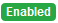 | Shown if the validator is currently **not disabled** |
| 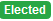 | Shown if the validator is **elected** for the next session |
| 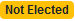 | Shown if the validator is **not elected** for the next session |
| 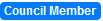 | Shown if the validator is a **member of the council** |

The badge colours follow these rules:
- Green: Nothing to worry about, these badges inform the user that the node is behaving as expected.
- Blue: Nothing to worry about, these badges are only used for informational purposes.
- Yellow: Warning! These badges may signal an incoming severe state.
- Red: Danger! These badges are shown when the node is in a severe state.

##### More Details Section

The aim of the More Details section is to complement the data shown in the Nodes Overview Table.

For **non-validator nodes** the following is shown:
- The number of peers.
- The amount of time passed since the last finalized height update.
    - On hover, the exact date & time PANIC detected the last finalized height update is given.
- The finalized height.
- The amount of time passed since PANIC detected the node as down for the first time (only if the node is down).
    - On hover, the exact date & time PANIC detected the node as down is given.

For **validator nodes**, the same data as non-validator nodes is shown together with the following data:
- The number of blocks authored in the current session.
- The bonded balance.

#### Monitors Status Section

The Monitors Status section shows the state of the PANIC monitors belonging to the selected chain. More specifically, the following is shown for each monitor:
- The type (blockchain or node).
- The amount of time passed since the last update from the monitor.
    - On hover, the exact date & time of the last monitor update is given.

### Alert Logs Page

The Alert Logs page shows incoming alerts in real-time. The user can also easily visualize historical alerts by navigating through this page using the **navigation buttons** at the bottom of the page.

For each alert on this page, the following is shown:
- The severity of the alert (shown according to a colour coding described below).
- The time PANIC raised this alert.
    - On hover, the exact date when PANIC raised this alert is given.
- The alert message.

The severity of each alert in the Alert Logs table follows this colour coding scheme:
- Green: *INFO* alerts
- Yellow: *WARNING* alerts
- Red: *CRITICAL* alerts
- Purple: *ERROR* alerts

### Settings Pages

The aim of the Settings Pages is to provide an easy setup for PANIC. In the current implementation there are three settings pages, each generating a different config file:
- **Main Settings Page**, used to link-up features that the user wishes to set-up. Generates the `user_config_main.ini` config. 
- **Nodes Settings Page**, used to add new nodes for monitoring. Generates the `user_config_nodes.ini` config.
- **Repos Settings Page**, used to add new repos for monitoring. Generates the `user_config_repos.ini` config.

The settings pages were developed keeping user friendliness in mind. In fact, in all pages, *testing buttons* together with *validation mechanisms* are provided so that the user can be sure that correct data is being inputted. In addition to this, information is provided for each input field along with example data so that the user knows what data should be inputted.

A feature of the settings pages is that they are able to load data in the page from the corresponding config if it exists already. This helps the user visualize the latest PANIC configuration and adjust accordingly if need be.

Another important thing worth mentioning is that the alerter is not able to detect changes in the config files, therefore, whenever the alerter is (re-)configured, the user must make sure that PANIC is (re-)started.

For a detailed read on how to set-up PANIC using the settings pages please [read this guide](./SETUP.md#using-the-web-ui)

### Preferences Page

The Preferences Page is used for alert fine-tuning. The user can use the preferences page to switch on/off (green/grey toggle) specific alerts or alert severities. As a result, the Preferences Page gives more fine-grained power over the alerts that PANIC emits.  

Similarly to the settings pages, the Preferences Page generates the `internal_config_alerts.ini` config. The page is also able to detect the current configuration in the `internal_config_alerts.ini` config. However, the alerter is not able to detect changes in the `internal_config_alert.ini` config, and therefore the alerter must be (re-)started whenever this config is updated.

---
[Back to main design page](./DESIGN_AND_FEATURES.md)